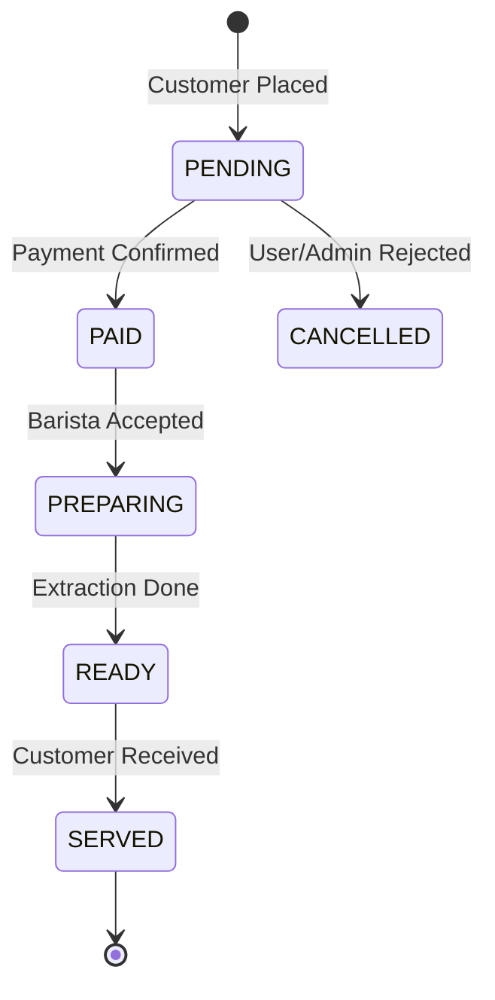

# Bean & Brew OS — Enterprise Backend Architecture & Production Implementation Guide

## 1. Executive Summary

### 1.1 Purpose
The Bean & Brew OS Backend is the authoritative digital infrastructure powering a luxury, real-time artisanal coffee management ecosystem. It facilitates multi-role interactions between connoisseur customers, professional baristas, and enterprise administrators. It is engineered for high-concurrency order processing, millisecond-precision synchronization, and multi-tenant administrative workflows.

### 1.2 Goals
- **Real-time Authority:** Single source of truth for order states, table sessions, and inventory levels.
- **Enterprise Scalability:** Horizonally scalable to support 10,000+ simultaneous cafes and millions of global users.
- **Financial-Grade Security:** Rigorous protection of transaction logs, PII, and payment integrations.
- **Resilient Operations:** 99.99% availability target with automated failover and self-healing queues.

---

## 2. Flutter Application Analysis & Backend Conversion

The Flutter application serves as the single source of truth for user flows and state transitions.

### 2.1 Navigation & State Mapping
- **Order Flow:** Flutter `OrderingBloc` -> Backend `OrderService` + `TransactionManager`.
- **Table Management:** Flutter `BaristaBloc` -> Backend `TableSessionState` in Redis/Postgres.
- **Personnel:** Flutter `AdminBloc` -> Backend `RBAC` + `ShiftTracker`.

### 2.2 Functional-to-Service Mapping
| App Module | Backend Domain Service | Database Targets |
| :--- | :--- | :--- |
| **Auth & Profile** | `IdentityService`, `OtpService` | `users`, `profiles`, `sessions` |
| **Artisanal Menu** | `MenuService`, `SearchEngine` | `products`, `customizations` |
| **Ordering Engine** | `OrderService`, `PaymentGateway` | `orders`, `transactions` |
| **Live Operations** | `TableService`, `SocketHub` | `table_sessions`, `redis_kv` |
| **Admin Analytics** | `ReportService`, `KpiAggregator` | `order_items`, `inventory_logs` |

---

## 3. Complete Functional Requirement Specification (FRS)

- **FRS-AUTH-01:** System shall support JWT-based authentication with Refresh Token rotation and device-specific session tracking.
- **FRS-ORDER-01:** Order placement must be an atomic transaction involving inventory locking and payment validation.
- **FRS-SYNC-01:** Every order state change must trigger a Socket.IO event to relevant rooms (Customer, Barista, Branch Admin).
- **FRS-INV-01:** System shall decrement stock automatically upon order completion and trigger `LOW_STOCK` alerts via BullMQ.

---

## 4. System Architecture

### 4.1 Layered Architecture Overview
1. **API Layer (Controllers):** Handles HTTP/Socket requests, input validation (Zod), and response formatting.
2. **Domain Layer (Services):** Orchestrates business logic, enforces domain rules, and manages state transitions.
3. **Infrastructure Layer (Repositories):** Interface with PostgreSQL (Prisma), Redis, S3, and 3rd-party APIs (Stripe, Twilio).

### 4.2 Real-time Mesh
Utilizes Socket.IO with a Redis Pub/Sub adapter to allow event synchronization across multiple horizontally scaled server instances.

---

## 5. Database Design (PostgreSQL)

### 5.1 Relational Schema
- **users:** `id(uuid), email(unique), password_hash, role(enum), created_at, updated_at`
- **profiles:** `user_id, first_name, last_name, phone, avatar_url, preferences(jsonb)`
- **products:** `id, name, slug(unique), description, category_id, base_price, is_active(bool)`
- **inventory:** `id, branch_id, item_name, quantity, unit(enum), threshold, status(enum)`
- **orders:** `id, user_id, branch_id, status(enum), total_amount, tax_amount, items(jsonb), payment_ref`
- **table_sessions:** `id, branch_id, table_number, status(enum), current_order_id, start_time`

### 5.2 Constraints & Performance
- **GIN Index:** On `products.name` and `products.description` for fuzzy search.
- **Unique Constraint:** On `branch_id` + `table_number` in `table_sessions`.
- **Soft Deletes:** `deleted_at` column on all primary entities to maintain historical references.

---

## 6. User Roles & RBAC (Role-Based Access Control)

| Role | Access Level | Data Restriction |
| :--- | :--- | :--- |
| **SUPER_ADMIN** | Global CRUD | None |
| **ADMIN** | Store CRUD, All Reports | Store-wide |
| **MANAGER** | Branch CRUD, Staff Shifts | Branch-specific |
| **BARISTA** | Order Queue, Table Status | Branch-specific |
| **CUSTOMER** | Personal Orders, Loyalty | User-specific |

---

## 7. Authentication & Security Implementation

- **Encryption:** Argon2id for password hashing.
- **Transport:** TLS 1.3 enforced globally.
- **Tokens:** RSA-256 signed JWTs.
- **Rate Limiting:** IP-based (Express-Rate-Limit) and User-based (Redis Token Bucket).
- **Headers:** Implementation of Helmet.js (HSTS, CSP, X-Frame-Options).

---

## 8. Order Management (The Heart)

### 8.1 State Machine Lifecycle

### 8.2 Inventory Sync Logic
- **Action:** Order Created (PAID).
- **Logic:** Atomic decrement in `inventory` table.
- **Edge Case:** If `quantity < 0` after decrement, rollback transaction and emit `OUT_OF_STOCK` event.

---

## 9. Socket.IO Realtime Architecture

### 9.1 Namespace Design
- **Namespace `/live`:** Targeted at Customers for personal order tracking.
- **Namespace `/ops`:** Targeted at Baristas and Admins for branch-wide coordination.

### 9.2 Event Catalog
| Event | Direction | Payload |
| :--- | :--- | :--- |
| `ORDER_NEW` | Server -> Barista | Order Object (Items, Customizations) |
| `ORDER_READY` | Server -> Customer | Order ID, Pickup Location |
| `TABLE_SYNC` | Server -> Branch Ops | Table ID, Status Change |
| `STOCK_ALERT` | Server -> Admin | Item ID, Current Level |

---

## 10. REST API Specification (Overview)

- **GET /v1/products:** Artisanal catalog with caching and pagination.
- **POST /v1/orders:** Order ingestion and transaction initiation.
- **GET /v1/tables:** Real-time branch floor-map data.
- **PATCH /v1/admin/employees/:id:** Role/Shift modification.

---

## 11. Monitoring, DevOps & CI/CD

- **CI:** GitHub Actions executing Jest unit tests and Docker image builds.
- **CD:** AWS ECS (Fargate) for server instances with Blue-Green deployments.
- **Monitoring:** Prometheus scraping metrics -> Grafana dashboards for latency and socket health.
- **Logging:** Winston structured logs (JSON) piped to CloudWatch/ELK.

---

## 12. Future Expansion (Roadmap)
- **KDS (Kitchen Display System):** Specialized WebSocket channel for multi-station preparation.
- **Predictive AI:** Analysis of `order_history` to forecast supply chain needs.
- **IoT Integration:** MQTT bridge for real-time grinder/boiler telemetry.

---
* bean-brew-enterprise-backend-spec-v1.0 *
